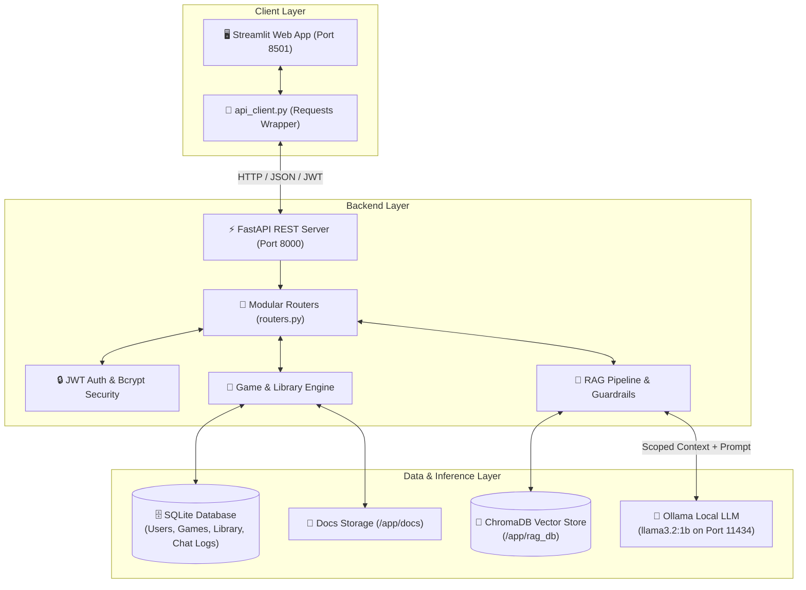

# 🎲 Tabletop Sage

> **Tabletop Sage** is an intelligent board game companion and grounded rules referee designed to resolve gameplay disputes during game night in seconds. Leveraging Retrieval-Augmented Generation (RAG) with ChromaDB vector search and local Ollama LLMs, it delivers accurate, citation-backed answers strictly grounded in official game documentation. Players can explore a community bank of board games with advanced filters, curate their personal library, and upload new rulebooks for instant AI-assisted adjudication.

---

## 🏗️ Architecture Diagram



### System Workflow
1. **Rulebook Ingestion**: When a `.txt` or `.md` rulebook is uploaded (or seeded), the backend stores the file in `docs/`, segments it by section headings into overlapping chunks, computes embeddings, and stores them in ChromaDB with metadata (`game_id`, `section`, `chunk_index`).
2. **Query Scoping & Retrieval**: Rules queries are scoped to a specific `game_id` using ChromaDB metadata filtering (`where={"game_id": game_id}`).
3. **Grounded Generation**: Top context chunks are injected into a strict system prompt (`temperature: 0.0`) evaluated by Ollama. Responses include confidence scores and expandable source excerpts.

---

## 📋 Prerequisites

Before running the application, ensure the following are installed:
- **Docker & Docker Compose**: Docker Engine v24.0+ and Docker Compose v2.0+
- **Python**: Python 3.10, 3.11, or 3.14 (if running locally without Docker)
- **Ollama**: [Ollama](https://ollama.com/) (if running LLM on host machine instead of container)

---

## 🚀 Setup Instructions

### 1. Clone the Repository
```bash
git clone https://github.com/your-username/tabletop_sage.git
cd tabletop_sage
```

### 2. Configure Environment Variables
Create your local `.env` configuration file from the template:
```bash
cp .env.example .env
```
*(The default `.env` is preconfigured for Docker Compose networking and local development).*

### 3. Launch the Stack with Docker Compose
Start all services (FastAPI backend, Streamlit frontend, and containerized Ollama) with a fresh build:
```bash
docker compose up --build -d
```

### 4. Download the Ollama Referee Model (First Time Only)
Pull the lightweight referee model into the Ollama container:
```bash
docker exec -it tabletop-ollama ollama pull llama3.2:1b
```

### 5. Access the Applications
- **🖥️ Streamlit Web Interface**: [http://localhost:8501](http://localhost:8501)
- **⚡ FastAPI Backend & Swagger Docs**: [http://localhost:8000/docs](http://localhost:8000/docs)
- **🩺 System Health Check**: [http://localhost:8000/health](http://localhost:8000/health)

To shut down the stack:
```bash
docker compose down
```

---

## 🌱 Game Seeding & Preloaded Catalog (22 Games)

Tabletop Sage comes with a curated catalog of **22 popular and classic board games** with structured, citation-ready rulebooks:

| Category | Games Included |
| :--- | :--- |
| **🏛️ Timeless Classics & Family** | **Chess**, **Backgammon**, **Monopoly**, **Uno**, **Scrabble**, **Clue (Cluedo)**, **Risk**, **Battleship**, **Yahtzee**, **Connect 4** |
| **🌟 Modern Hits & Strategy** | **Catan**, **Ticket to Ride**, **Wingspan**, **Pandemic**, **Carcassonne**, **Splendor**, **7 Wonders**, **Azul** |
| **🎭 Party & Social Deduction** | **Codenames**, **Secret Hitler**, **Coup**, **King of Tokyo** |

### Seeding Methods

#### Option A: Automatic Auto-Seeding (Default)
When the backend boots up, its startup lifecycle hook checks the database: if fewer than 22 games exist, it **automatically populates SQLite and vector-indexes all 147 rulebook chunks into ChromaDB**.

#### Option B: Manual Seeding via Docker Exec
To force re-seed, update, or reset all 22 board games inside a running Docker container:
```bash
docker exec -it tabletop-backend python seed_data.py
```

#### Option C: Manual Seeding Locally (Python venv)
```bash
source venv/bin/activate
python backend/seed_data.py
```

---

## 🎯 Game Specifics Metadata & Discovery Filters

Every board game in Tabletop Sage supports rich discovery metadata:

| Field Name | Type | Description | Example |
| :--- | :--- | :--- | :--- |
| `min_players` | `int` | Minimum required players | `2` |
| `max_players` | `int` | Maximum player count (or exact count if same as min) | `4` (Displays `👥 2–4 Players`) |
| `min_age` | `int` | Recommended minimum age | `10` (Displays `🎂 Age 10+`) |
| `estimated_playtime` | `int` | Estimated game duration in minutes | `60` (Displays `⏱️ 60 min`) |
| `complexity` | `str` | Weight rating (`Light / Casual`, `Medium`, `Heavy / Expert`) | `Medium` (Displays `⚖️ Medium`) |
| `category` | `str` | Primary genre / category | `Strategy` (Displays `🧩 Strategy`) |
| `publisher` | `str` | Publishing studio or designer | `Days of Wonder` (Displays `🏢 Days of Wonder`) |
| `year_published` | `int` | Original publication year | `2004` (Displays `(2004)`) |

### Game Bank Discovery & Filter Controls
The **🔍 Game Bank** provides a search bar and interactive filter controls:
- **Keyword Search**: Matches game title, description, category, or publisher.
- **Player Count Filter**: Filter by exact group size (`1 Player (Solo)`, `2 Players`, `3 Players`, `4 Players`, `5 Players`, `6+ Players`).
- **Category / Genre Filter**: Filter by `Strategy`, `Family`, `Party`, `Cooperative`, `Abstract Strategy`, `Economic`, `Deck-Building`, `Dice`, etc.
- **Complexity Filter**: Filter by `Light / Casual`, `Medium`, or `Heavy / Expert`.
- **Max Playtime Filter**: Filter by available game night time (`Under 30 min`, `Under 45 min`, `Under 60 min`, `Under 90 min`, `Under 120 min`).

---

## 📖 Usage Guide

### 1. Ingesting New Board Game Rulebooks
1. Log in or create an account from the sidebar.
2. Navigate to **"📤 Upload Game"** in the sidebar.
3. Enter the game title, optional description, and specific metadata (Player range, Min age, Playtime, Category, Complexity, Publisher, Year).
4. Attach a plain text (`.txt`) or Markdown (`.md`) rulebook file.
5. Click **"🚀 Upload & Vector Index Game"** to chunk and embed into ChromaDB.

### 2. Curating Your Personal Library
1. Navigate to **"🔍 Game Bank"** to browse all games.
2. Use the search bar and filter controls to find games fitting your group.
3. Click **"★ Add to Library"** on any game card to add it to your personal favorites.
4. Access saved games anytime from the **"📚 My Library"** tab.

### 3. Asking Rules Questions (RAG Referee)
1. Open a game's workspace by clicking **"⚔️ Open Workspace"**.
2. Select the **"🤖 Rules Referee (RAG Chat)"** tab.
3. Ask any rules question (e.g., *"Can you stack a Draw 2 in Uno?"* or *"What causes an outbreak in Pandemic?"*).
4. Tabletop Sage returns:
   - A direct, grounded answer synthesized by the LLM.
   - A color-coded **Confidence Badge** (`High`, `Moderate`, `Low`).
   - An expandable **"📚 View Rulebook Citations"** section showing exact source excerpts, sections, and similarity scores.

### 4. Reading Official Rulebooks
1. In the **Game Workspace**, switch to the **"📖 Official Rulebook"** tab to view the complete rulebook in a scrollable viewer.

---

## 📡 API Endpoints

| Method | Endpoint | Query / Form Parameters | Description | Auth Required |
| :--- | :--- | :--- | :--- | :--- |
| `POST` | `/auth/register` | JSON (`username`, `password`, `role`) | Register a new user account | No |
| `POST` | `/auth/token` | OAuth2 Form (`username`, `password`) | Login and retrieve JWT bearer token | No |
| `GET` | `/auth/me` | Header (`Authorization: Bearer <token>`) | Fetch current authenticated user profile | **Yes** |
| `GET` | `/games` | `q`, `players`, `category`, `complexity`, `max_playtime`, `min_age`, `skip`, `limit` | Browse and filter board games in bank | No |
| `POST` | `/games` | Form: `name`, `description`, `min_players`, `max_players`, `min_age`, `estimated_playtime`, `complexity`, `category`, `publisher`, `year_published`, `file` | Upload new game and index rulebook | **Yes** |
| `GET` | `/games/{game_id}` | Path: `game_id` | Retrieve metadata for a single game | No |
| `GET` | `/games/{game_id}/rulebook` | Path: `game_id` | Retrieve raw rulebook text content | No |
| `GET` | `/library` | Header (`Authorization: Bearer <token>`) | List games in user's personal library | **Yes** |
| `POST` | `/library/{game_id}` | Path: `game_id` | Add game to user's personal library | **Yes** |
| `DELETE` | `/library/{game_id}` | Path: `game_id` | Remove game from user's personal library | **Yes** |
| `POST` | `/games/{game_id}/ask` | JSON (`question`, `session_id`) | Submit a rules question scoped to game | No (Logged if token provided) |
| `GET` | `/health` | None | System diagnostics (DB, ChromaDB, LLM) | No |

---

## 🛠️ Tech Stack

| Component | Technology | Description |
| :--- | :--- | :--- |
| **Backend API** | [FastAPI](https://fastapi.tiangolo.com/) | High-performance Python web framework with modular routers |
| **Database & ORM** | [SQLAlchemy](https://www.sqlalchemy.org/) & [SQLite](https://www.sqlite.org/) | Relational database for users, games, library, and chat logs |
| **Data Validation** | [Pydantic v2](https://docs.pydantic.dev/) | Request/response schema validation and serialization |
| **Authentication** | Native [bcrypt](https://pypi.org/project/bcrypt/) & [python-jose](https://pypi.org/project/python-jose/) | Password hashing and signed JWT bearer tokens |
| **Vector Store** | [ChromaDB](https://www.trychroma.com/) | Persistent vector database with metadata filtering |
| **LLM Inference** | [Ollama](https://ollama.com/) (`llama3.2:1b`) | Local open-weights model inference with zero-temperature guardrails |
| **Embeddings** | `all-MiniLM-L6-v2` | Lightweight semantic text embeddings |
| **Frontend UI** | [Streamlit](https://streamlit.io/) | Reactive web application interface with responsive filter badges |
| **DevOps** | [Docker](https://www.docker.com/) & Docker Compose | Multi-container stack orchestration with persistent volumes |
| **CI/CD** | GitHub Actions | Automated linting (`ruff`), Docker build checks, and `pytest` suite |

---

## 🧪 Testing

The backend includes a test suite covering authentication, CRUD operations, metadata filtering, document chunking, and RAG retrieval.

To run tests locally:
```bash
source venv/bin/activate
pytest backend/tests/ -v
```

### Test Coverage Highlights:
- `backend/tests/test_auth.py`: Registration, duplicate username handling, token login, and protected route access.
- `backend/tests/test_crud.py`: Game bank listing, search filters (`players`, `category`, `complexity`, `max_playtime`), file upload with full metadata, rulebook inspection, and personal library addition/removal.
- `backend/tests/test_rag.py`: Section-based chunking logic, scoped vector search, and citation verification.
