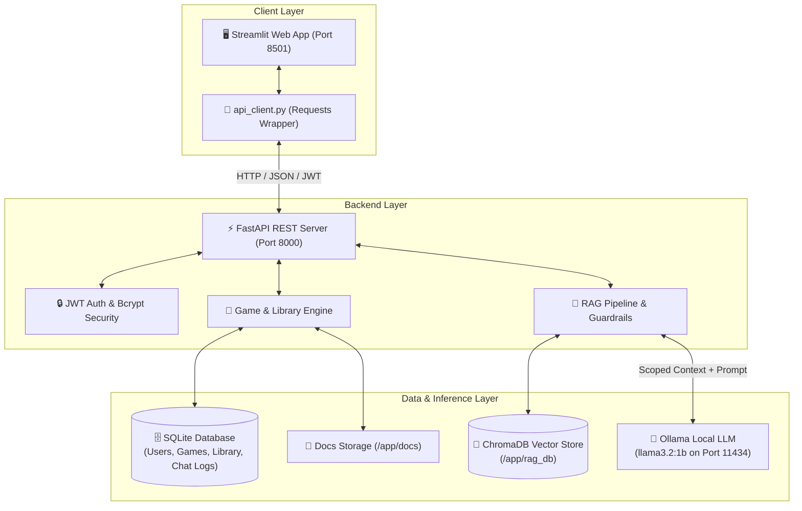

# 🎲 Tabletop Sage

> **Tabletop Sage** is an intelligent board game companion and grounded rules referee designed to resolve gameplay disputes during game night in seconds. Leveraging Retrieval-Augmented Generation (RAG) with ChromaDB vector search and local Ollama LLMs, it delivers accurate, citation-backed answers strictly grounded in official game documentation. Players can explore a community bank of board games, curate their personal library, and upload new rulebooks for instant AI-assisted adjudication.

---

## 🏗️ Architecture Diagram



### System Workflow
1. **Rulebook Ingestion**: When a `.txt` or `.md` rulebook is uploaded, the backend stores the file in `docs/`, segments it by section headings into overlapping chunks, computes embeddings, and stores them in ChromaDB with metadata (`game_id`, `section`, `chunk_index`).
2. **Query Scoping & Retrieval**: Rules queries are scoped to a specific `game_id` using ChromaDB metadata filtering (`where={"game_id": game_id}`).
3. **Grounded Generation**: Top context chunks are injected into a strict system prompt (`temperature: 0.0`) evaluated by Ollama. Responses include confidence scores and expandable source excerpts.

---

## 📋 Prerequisites

Before running the application, ensure the following are installed:
- **Docker & Docker Compose**: Docker Engine v24.0+ and Docker Compose v2.0+
- **Python**: Python 3.10, 3.11, or 3.14 (if running locally without Docker)
- **Ollama**: [Ollama](https://ollama.com/) (if running LLM on host machine instead of container)

---

## 🚀 Setup Instructions

### 1. Clone the Repository
```bash
cd /Users/mehdi/Documents/code_temple_exeercises/module-09-capstone/project/tabletop_sage
```

### 2. Configure Environment Variables
Create your local `.env` configuration file from the template:
```bash
cp .env.example .env
```
*(The default `.env` is preconfigured for Docker Compose networking and local development).*

### 3. Launch the Stack with Docker Compose
Start all services (FastAPI backend, Streamlit frontend, and containerized Ollama) in detached mode:
```bash
docker-compose up --build -d
```

### 4. Download the Ollama Referee Model (First Time Only)
Pull the lightweight referee model into the Ollama container:
```bash
docker exec -it tabletop-ollama ollama pull llama3.2:1b
```

### 5. Access the Applications
- **🖥️ Streamlit Web Interface**: [http://localhost:8501](http://localhost:8501)
- **⚡ FastAPI Backend & Swagger Docs**: [http://localhost:8000/docs](http://localhost:8000/docs)
- **🩺 System Health Check**: [http://localhost:8000/health](http://localhost:8000/health)

To shut down the stack:
```bash
docker-compose down
```

---

## 📖 Usage Guide

### 1. Ingesting New Board Game Rulebooks
1. Log in or create an account from the sidebar.
2. Navigate to **"📤 Upload Game"** in the sidebar.
3. Enter the game title (e.g., *Carcassonne*), optional description, and attach a plain text (`.txt`) or Markdown (`.md`) rulebook.
4. Click **"🚀 Upload & Vector Index Game"**.
5. The backend will automatically save the file, segment rules into indexed chunks, and store embeddings in ChromaDB.

### 2. Curating Your Personal Library
1. Navigate to **"🔍 Game Bank"** to browse all community games.
2. Use the live search bar to filter by title or keyword.
3. Click **"★ Add to Library"** on any game card to add it to your personal favorites.
4. Access saved games anytime from the **"📚 My Library"** tab.

### 3. Asking Rules Questions (RAG Referee)
1. Open a game's workspace from the Game Bank or My Library by clicking **"⚔️ Open Workspace"**.
2. Select the **"🤖 Rules Referee (RAG Chat)"** tab.
3. Type your question in the chat input (e.g., *"How many victory points do I need to win?"* or *"Can I trade while in Jail?"*).
4. Tabletop Sage returns:
   - A direct, grounded answer synthesized by the LLM.
   - A color-coded **Confidence Badge** (`High`, `Moderate`, `Low`).
   - An expandable **"📚 View Rulebook Citations"** container showing the exact source excerpts, section names, and similarity scores.

### 4. Reading Official Rulebooks
1. In the **Game Workspace**, switch to the **"📖 Official Rulebook"** tab to read the full source document in a scrollable viewer.

---

## 📡 API Endpoints

| Method | Endpoint | Description | Auth Required |
| :--- | :--- | :--- | :--- |
| `POST` | `/auth/register` | Register a new user account | No |
| `POST` | `/auth/token` | Authenticate credentials and obtain JWT bearer token | No |
| `GET` | `/auth/me` | Fetch profile information for the authenticated user | **Yes** (Bearer JWT) |
| `GET` | `/games` | Search and list board games in the bank (`?q=query`) | No |
| `POST` | `/games` | Upload a new board game and index its rulebook | **Yes** (Bearer JWT) |
| `GET` | `/games/{game_id}` | Retrieve metadata for a single board game | No |
| `GET` | `/games/{game_id}/rulebook` | Retrieve raw rulebook text content | No |
| `GET` | `/library` | List games in the authenticated user's personal library | **Yes** (Bearer JWT) |
| `POST` | `/library/{game_id}` | Add a game to the user's personal library | **Yes** (Bearer JWT) |
| `DELETE` | `/library/{game_id}` | Remove a game from the user's personal library | **Yes** (Bearer JWT) |
| `POST` | `/games/{game_id}/ask` | Submit a rules question scoped to a specific game | No (Logged if token provided) |
| `GET` | `/health` | System health diagnostics (DB, ChromaDB, Ollama) | No |

---

## 🛠️ Tech Stack

| Component | Technology | Description |
| :--- | :--- | :--- |
| **Backend API** | [FastAPI](https://fastapi.tiangolo.com/) | High-performance asynchronous Python web framework |
| **Database & ORM** | [SQLAlchemy](https://www.sqlalchemy.org/) & [SQLite](https://www.sqlite.org/) | Relational database modeling users, games, library, and chat logs |
| **Data Validation** | [Pydantic v2](https://docs.pydantic.dev/) | Request/response schema validation and serialization |
| **Authentication** | Native [bcrypt](https://pypi.org/project/bcrypt/) & [python-jose](https://pypi.org/project/python-jose/) | Password hashing and signed JWT bearer token management |
| **Vector Store** | [ChromaDB](https://www.trychroma.com/) | Persistent vector database with metadata filtering |
| **LLM Inference** | [Ollama](https://ollama.com/) (`llama3.2:1b`) | Local open-weights model inference with zero-temperature guardrails |
| **Embeddings** | `all-MiniLM-L6-v2` | Fast, lightweight semantic text embeddings |
| **Frontend UI** | [Streamlit](https://streamlit.io/) | Reactive web application interface |
| **DevOps** | [Docker](https://www.docker.com/) & Docker Compose | Multi-container stack orchestration with named volumes |
| **CI/CD** | GitHub Actions | Automated linting (`ruff`), Docker build checks, and `pytest` suite |

---

## 🧪 Testing

The backend includes a test suite covering authentication, CRUD operations, document chunking, and RAG retrieval. Tests execute in isolated temporary storage environments so they never mutate production databases or uploaded documents.

To run tests locally:
```bash
cd backend
pytest tests/ -v
```

### Test Coverage Highlights:
- `tests/test_auth.py`: Registration, duplicate username handling, token login, and protected route access.
- `tests/test_crud.py`: Game bank listing, file upload, rulebook inspection, and personal library addition/removal.
- `tests/test_rag.py`: Section-based chunking logic, scoped vector search, and citation verification.


