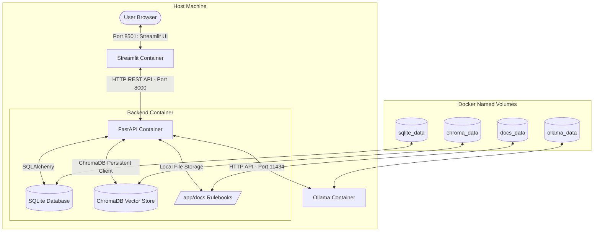
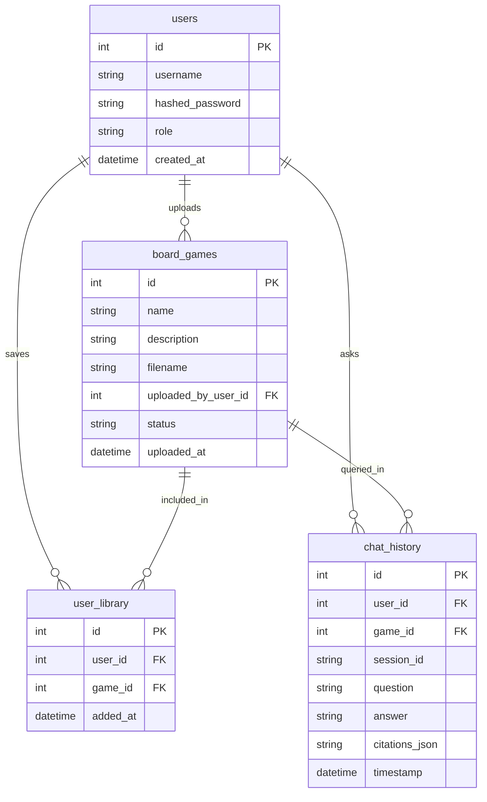

# Tabletop Sage: System Design Document

This design document outlines the system architecture, database schema, API endpoints, RAG pipeline design, frontend structure, and Docker containerization plan for the **Tabletop Sage** Capstone project.

---

## 1. System Architecture & Data Flow

### Architecture Diagram



### End-to-End Data Flows

#### Flow 1: Game Discovery & Personal Library Curation
1. **Search Bank**: User searches or filters board games on the Streamlit UI (`GET /games?q=catan`).
2. **Catalog Fetch**: FastAPI queries SQLite `board_games` table and returns matching game cards.
3. **Add to Library**: User clicks "Add to Library" on a game card (`POST /library/{game_id}` with JWT Bearer token).
4. **Association Record**: FastAPI inserts a `UserLibrary` entry linking `user_id` and `game_id`.

#### Flow 2: Rulebook Reading & Game-Scoped RAG Assistant
1. **Select Game**: User selects a game from "My Library".
2. **Fetch Rulebook**: Streamlit calls `GET /games/{game_id}/rulebook` to render the official documentation in the rule viewer tab.
3. **Ask Question**: User submits a text or STT voice question (e.g., *"How many victory points do I need to win?"*) via `POST /games/{game_id}/ask`.
4. **Scoped Vector Search**: FastAPI queries ChromaDB with metadata filter `where={"game_id": game_id}` to retrieve only chunks from that specific game's rulebook.
5. **Prompt Assembly**: Backend formats retrieved chunk context with a strict grounding system prompt.
6. **LLM Inference**: Ollama (`llama3.2:1b` or `llama3.1:8b`) generates a concise answer with citation references.
7. **Audit Log & UI Render**: Backend logs query/response in SQLite `chat_history` and Streamlit displays the response with citation expanders and confidence scores.

#### Flow 3: Community Game & Rulebook Upload
1. **Upload Form**: User fills game name, description, and uploads a rulebook (`.txt`, `.md`, `.pdf`) on the "Upload Game" portal.
2. **Ingest Endpoint**: Streamlit sends multipart request to `POST /games`.
3. **Storage & Record**: FastAPI saves rulebook to persistent storage and creates a `BoardGame` record with `uploaded_by_user_id`.
4. **Chunking & Embeddings**: Ingestion worker chunks the rulebook text, tags each chunk with metadata (`game_id`, `game_name`, `section`), generates vector embeddings, and writes to ChromaDB.
5. **Immediate Availability**: The new game immediately appears in the community bank for all users to discover, add to library, and query.

---

## 2. Relational Database Schema (SQLAlchemy)

The relational schema manages user accounts, game catalog records, user personal library associations, and chat audit logging.



### Table Specifications

#### A. `User` Model
Represents registered users of the platform (players and administrators).
- `id`: `Integer`, Primary Key, autoincrement.
- `username`: `String(50)`, Unique, Nullable=False, Indexed.
- `hashed_password`: `String(255)`, Nullable=False.
- `role`: `String(20)`, Default="player" ("player" | "admin").
- `created_at`: `DateTime`, Default=timezone.utc.
- _Relationships_:
  - `uploaded_games`: `relationship("BoardGame", back_populates="uploader")`
  - `library_entries`: `relationship("UserLibrary", back_populates="user", cascade="all, delete-orphan")`
  - `chats`: `relationship("ChatLog", back_populates="user")`

#### B. `BoardGame` Model
Stores metadata for games available in the shared bank.
- `id`: `Integer`, Primary Key, autoincrement.
- `name`: `String(100)`, Nullable=False, Indexed.
- `description`: `Text`, Nullable=True.
- `filename`: `String(255)`, Unique, Nullable=False.
- `uploaded_by_user_id`: `Integer`, Foreign Key referencing `users.id`, Nullable=False.
- `status`: `String(20)`, Default="active" ("active" | "flagged").
- `uploaded_at`: `DateTime`, Default=timezone.utc.
- _Relationships_:
  - `uploader`: `relationship("User", back_populates="uploaded_games")`
  - `library_entries`: `relationship("UserLibrary", back_populates="game", cascade="all, delete-orphan")`
  - `chats`: `relationship("ChatLog", back_populates="game")`

#### C. `UserLibrary` Model (Association Table)
Maps the Many-to-Many relationship between users and their favorite/saved games.
- `id`: `Integer`, Primary Key, autoincrement.
- `user_id`: `Integer`, Foreign Key referencing `users.id`, Nullable=False.
- `game_id`: `Integer`, Foreign Key referencing `board_games.id`, Nullable=False.
- `added_at`: `DateTime`, Default=timezone.utc.
- _Indexes / Constraints_: `UniqueConstraint('user_id', 'game_id', name='uq_user_game')`.
- _Relationships_:
  - `user`: `relationship("User", back_populates="library_entries")`
  - `game`: `relationship("BoardGame", back_populates="library_entries")`

#### D. `ChatLog` Model
Stores Q&A history for conversation continuity, metrics, and auditability.
- `id`: `Integer`, Primary Key, autoincrement.
- `user_id`: `Integer`, Foreign Key referencing `users.id`, Nullable=True (supports guest sessions).
- `game_id`: `Integer`, Foreign Key referencing `board_games.id`, Nullable=False.
- `session_id`: `String(100)`, Nullable=False.
- `question`: `Text`, Nullable=False.
- `answer`: `Text`, Nullable=False.
- `citations_json`: `Text`, Nullable=True (JSON string of retrieved citations).
- `timestamp`: `DateTime`, Default=timezone.utc.
- _Relationships_:
  - `user`: `relationship("User", back_populates="chats")`
  - `game`: `relationship("BoardGame", back_populates="chats")`

---

## 3. API Endpoint Specification

All backend endpoints use Pydantic models for request/response serialization, validation, and OpenAPI documentation.

| Endpoint | Method | Auth Required? | Request Payload | Response Model | Description |
| :--- | :--- | :--- | :--- | :--- | :--- |
| `/auth/register` | `POST` | No | `UserCreate` | `UserResponse` | Registers a new user account. |
| `/auth/token` | `POST` | No | `OAuth2PasswordRequestForm` | `Token` | Authenticates user and returns JWT token. |
| `/auth/me` | `GET` | **Yes** | _None_ | `UserResponse` | Returns profile of current authenticated user. |
| `/games` | `GET` | No | Query params: `q`, `skip`, `limit` | `List[BoardGameResponse]` | Search and browse the bank of board games. |
| `/games` | `POST` | **Yes** | Multipart: `name`, `description`, `file` | `BoardGameResponse` | Uploads a new board game & rulebook to the bank. |
| `/games/{game_id}` | `GET` | No | _None_ | `BoardGameResponse` | Retrieves detailed metadata for a single game. |
| `/games/{game_id}/rulebook` | `GET` | No | _None_ | `RulebookContentResponse` | Retrieves raw/formatted text of the rulebook. |
| `/library` | `GET` | **Yes** | _None_ | `List[BoardGameResponse]` | Retrieves all games in authenticated user's library. |
| `/library/{game_id}` | `POST` | **Yes** | _None_ | `LibraryActionResponse` | Adds a game from the bank to user's library. |
| `/library/{game_id}` | `DELETE` | **Yes** | _None_ | `LibraryActionResponse` | Removes a game from user's library. |
| `/games/{game_id}/ask` | `POST` | Optional | `QueryRequest` | `QueryResponse` | Queries the RAG assistant scoped to `game_id`. |
| `/games/{game_id}/voice-ask` | `POST` | Optional | Multipart: `audio_file` (WAV/MP3) | `QueryResponse` | Transcribes audio via STT and runs scoped RAG query. |
| `/health` | `GET` | No | _None_ | `HealthStatus` | Health check for SQLite, ChromaDB, and Ollama. |

---

## 4. Frontend Application Structure (Streamlit)

The Streamlit frontend is organized into 4 primary views with shared session authentication state:

```
frontend/
├── app.py                 # Multi-page router, sidebar auth, navigation state
├── api_client.py          # Centralized HTTP client wrapping FastAPI endpoints
├── views/
│   ├── discovery.py       # Game Bank search, filters, and "Add to Library" action
│   ├── library.py         # My Library cards, game selector, and "Open Workspace"
│   ├── workspace.py       # Side-by-side / Tabbed: Rulebook Reader + Game RAG Chat
│   └── upload.py          # Upload game form + rulebook file uploader
└── requirements.txt
```

### UI View Details:
1. **Game Bank (Discovery)**:
   - Live search input matching title/description.
   - Game cards showing uploader, upload date, and a 1-click **"★ Add to My Library"** / **"✓ In Library"** button.
2. **My Library**:
   - Grid layout of all user-saved games.
   - Quick "Launch Game Workspace" button or "Remove from Library" option.
3. **Game Workspace**:
   - **Tab 1 - Rulebook Viewer**: Full markdown/text viewer with search-in-doc capability.
   - **Tab 2 - RAG Rules Assistant**: Chat interface with text input & `streamlit-mic-recorder` voice button. Displays responses with citation cards (source chunk & section) and confidence score.
4. **Upload Portal**:
   - Submission form accepting Game Title, Description, and Rulebook (`.txt`, `.md`, `.pdf`).
   - Progress bar during server-side document chunking and vector indexing.

---

## 5. Docker Compose & Data Persistence Plan

### Container Network & Storage

```yaml
version: "3.9"

services:
  ollama:
    image: ollama/ollama:latest
    container_name: tabletop_ollama
    volumes:
      - ollama_data:/root/.ollama
    ports:
      - "11434:11434"
    restart: unless-stopped

  backend:
    build: ./backend
    container_name: tabletop_backend
    ports:
      - "8000:8000"
    environment:
      - DATABASE_URL=sqlite:////app/data/tabletop_sage.db
      - CHROMA_PATH=/app/rag_db
      - DOCS_STORAGE_PATH=/app/docs_storage
      - OLLAMA_URL=http://ollama:11434
      - JWT_SECRET_KEY=tabletop_sage_super_secret_jwt_key
    volumes:
      - sqlite_data:/app/data
      - chroma_data:/app/rag_db
      - docs_data:/app/docs_storage
    depends_on:
      - ollama
    restart: unless-stopped

  frontend:
    build: ./frontend
    container_name: tabletop_frontend
    ports:
      - "8501:8501"
    environment:
      - BACKEND_URL=http://backend:8000
    depends_on:
      - backend
    restart: unless-stopped

volumes:
  sqlite_data:
  chroma_data:
  docs_data:
  ollama_data:
```

### Persistence Guarantees
- **`sqlite_data`**: Persists user accounts, password hashes, library links, game catalog metadata, and chat history.
- **`chroma_data`**: Persists chunk embeddings so re-indexing is never required on container restart.
- **`docs_data`**: Persists uploaded raw rulebook documents (`.txt`, `.md`, `.pdf`) for rulebook viewing.
- **`ollama_data`**: Persists pulled Ollama models (`llama3.2:1b`) to avoid redownloading gigabytes of weights across restarts.

